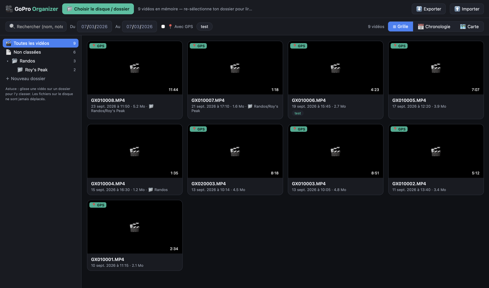
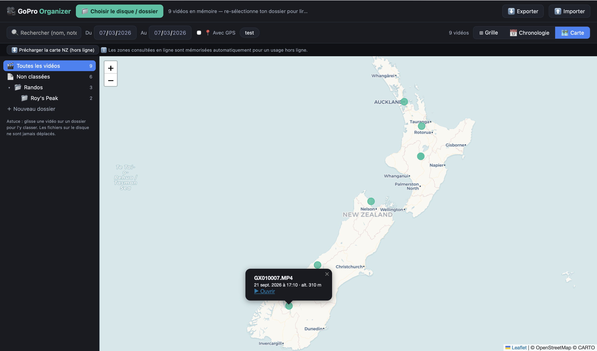

# 🎥 GoPro Organizer

*Your adventure footage, finally findable.*

A single-file, offline-first web app to organize GoPro videos straight from your external hard drive. No install, no account, no cloud — just open one HTML file in your browser and point it at your footage.

Built for a road trip across **New Zealand** 🇳🇿, but it works anywhere your GoPro does — the Alps, Patagonia, your backyard trampoline.

## What it does

- **Reads the metadata GoPro hides in your files** — shooting date, duration, and GPS position are extracted directly from the MP4s (GPMF telemetry, both `GPS9` from recent Heros and `GPS5` from older ones). No sidecar files, no manual entry.
- **Puts your clips on a map** 🗺️ — every video with a GPS fix becomes a marker. Click it, watch the clip, remember that view.
- **Timeline view** 📅 — browse your trip day by day, like a travel journal that filmed itself.
- **Folders & subfolders** 📁 — organize clips into virtual folders (`Hikes/Tongariro`, `Kayak/Abel Tasman`...) with drag & drop. Your files on disk are never moved or renamed.
- **Tags & notes** 🏷️ — label clips (`drone`, `sunset`, `keeper`) and jot down what made the moment.
- **Works offline** ✈️ — everything runs locally. You can even pre-download the map of New Zealand (~45 MB) for van-life evenings with zero signal. Any other region you browse online gets cached automatically.
- **French & English** 🌐 — switch anytime.

## Quick start

1. Download `gopro-organizer.html` (that's the whole app).
2. Open it in your browser.
3. Click **Choose drive / folder** and select the folder with your GoPro files (e.g. `DCIM` on your SD card or backup drive).
4. Watch it index your clips — then explore by map, date, folder, or tag.

That's it. No `npm install`. No build step. No terminal.

## Sample footage

The `videos-test-gopro/` folder contains 9 tiny fake GoPro files mimicking a September trip across New Zealand (Auckland → Hobbiton → Tongariro → Milford Sound). They carry real metadata — dates, GPS coordinates, durations — but no actual video, so you can try every feature without gigabytes of footage. Select that folder on first launch and play around.

## Where your data lives

All metadata — folders, tags, notes, thumbnails, cached map tiles — is stored in your browser's **IndexedDB**, locally on your machine. Nothing ever leaves your computer.

Two things to know:

- The index is tied to one browser. Safari and Chrome each keep their own.
- Clearing your browser's website data erases the index (never your videos). Use **⬇️ Export** regularly to save everything to a JSON file — keep it on the drive next to your footage, and **⬆️ Import** restores it anywhere.

## Browser notes

| | Chrome / Edge | Safari | Firefox |
|---|---|---|---|
| Everything works | ✅ | ✅ | ✅ |
| Remembers your folder between sessions | ✅ | ❌ re-select it (one click) | ❌ re-select it |
| Plays HEVC (GoPro's default codec) | Mostly ✅ | ✅ native | ⚠️ depends |

## Roadmap-ish

Ideas for a v2, if the wind blows that way: a small native build (Tauri) with the index stored as SQLite **on the drive itself**, so it travels with your footage across machines. PRs and ideas welcome.

## License

MIT — take it on your own adventure.

---

*Map tiles: [© OpenStreetMap](https://www.openstreetmap.org/copyright) contributors, rendered by [CARTO](https://carto.com/). Map library: [Leaflet](https://leafletjs.com/) (inlined for offline use).*
